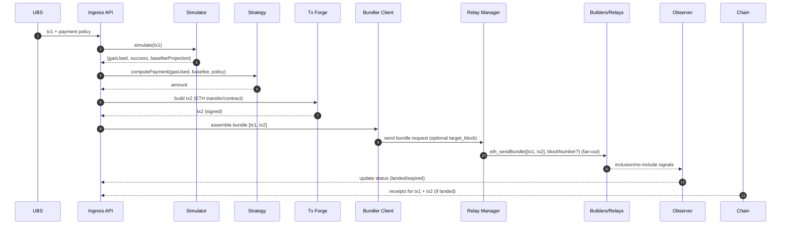

# Architecture Guide

## System Overview

The Atomic Bundler is a middleware service designed to facilitate builder-paid atomic bundles on Ethereum. It bridges the gap between users who want to submit transactions without paying priority fees and MEV builders who can profit from transaction inclusion.

## Core Components

### 1. Middleware (Binary Crate)

**Responsibilities:**
- HTTP API server using Axum
- Request orchestration and workflow management
- Bundle lifecycle management
- Admin endpoints and health checks

**Key Modules:**
- `api/` - REST API handlers and routing
- `handlers/` - Business logic for each endpoint
- `middleware/` - HTTP middleware (auth, logging, metrics)
- `storage/` - Database operations and bundle persistence
- `scheduler/` - Background tasks and bundle submission

### 2. Relay Client (Library Crate)

**Responsibilities:**
- Communication with MEV builder relays
- `eth_sendBundle` RPC calls
- Relay health monitoring
- Connection pooling and retry logic
- Response parsing and error handling

**Key Modules:**
- `client/` - HTTP client implementation
- `relays/` - Builder-specific relay implementations
- `health/` - Relay health checking
- `types/` - Relay-specific request/response types

### 3. Simulator (Library Crate)

**Responsibilities:**
- Transaction simulation and validation
- Gas estimation for payment calculations
- State analysis and conflict detection
- Pluggable simulation backends

**Key Modules:**
- `traits/` - Simulation interface definitions
- `engines/` - Different simulation implementations
- `validation/` - Transaction validation logic
- `gas/` - Gas estimation utilities

**Note:** Initially implemented as stub interfaces to allow for future pluggable backends (e.g., local node, third-party services).

### 4. Payment (Library Crate)

**Responsibilities:**
- Payment calculation based on configurable formulas
- Transaction forging for builder payments
- Payment validation and cap enforcement
- Support for different payment modes (direct, permit, escrow)

**Key Modules:**
- `calculator/` - Payment formula implementations
- `forger/` - Transaction creation and signing
- `policies/` - Payment policies and limits
- `modes/` - Different payment mechanisms

### 5. Config (Library Crate)

**Responsibilities:**
- Configuration file parsing (YAML)
- Environment variable integration
- Configuration validation
- Hot reloading support

**Key Modules:**
- `parser/` - YAML configuration parsing
- `validation/` - Configuration validation rules
- `reload/` - Hot reload functionality
- `defaults/` - Default configuration values

### 6. Types (Library Crate)

**Responsibilities:**
- Shared domain types across all crates
- Serialization/deserialization definitions
- Error types and result wrappers
- Common utilities and constants

**Key Modules:**
- `bundle/` - Bundle-related types
- `payment/` - Payment and pricing types
- `relay/` - Builder relay types
- `errors/` - Error definitions
- `utils/` - Common utilities

## Data Flow

### 1. Bundle Submission Flow

```
Client Request
     ↓
API Handler (middleware)
     ↓
Validation & Parsing (types)
     ↓
Payment Calculation (payment)
     ↓
Transaction Simulation (simulator)
     ↓
Bundle Creation & Storage (middleware)
     ↓
Relay Submission (relay_client)
     ↓
Response to Client
```

## Sequence (Mermaid)



### 2. Bundle Processing Pipeline

```
Bundle Submission
     ↓
┌─────────────────────────────────────────┐
│ 1. Request Validation                   │
│    • EIP-1559 transaction parsing      │
│    • Priority fee = 0 check            │
│    • Signature verification            │
└─────────────────────────────────────────┘
     ↓
┌─────────────────────────────────────────┐
│ 2. Payment Calculation                  │
│    • Apply formula (flat/gas/basefee)   │
│    • Check caps and limits              │
│    • Calculate builder payment          │
└─────────────────────────────────────────┘
     ↓
┌─────────────────────────────────────────┐
│ 3. Transaction Simulation               │
│    • Estimate gas usage                 │
│    • Validate transaction execution     │
│    • Check for conflicts                │
└─────────────────────────────────────────┘
     ↓
┌─────────────────────────────────────────┐
│ 4. Bundle Creation                      │
│    • Forge payment transaction (tx2)    │
│    • Create atomic bundle [tx1, tx2]    │
│    • Generate bundle ID                 │
└─────────────────────────────────────────┘
     ↓
┌─────────────────────────────────────────┐
│ 5. Multi-Relay Submission               │
│    • Submit to all enabled builders     │
│    • Track submission status            │
│    • Handle relay failures gracefully   │
└─────────────────────────────────────────┘
     ↓
┌─────────────────────────────────────────┐
│ 6. Monitoring & Tracking                │
│    • Update bundle status               │
│    • Log operations                     │
└─────────────────────────────────────────┘
```

## Storage Architecture

### Database Schema (SQLite)

```sql
-- Bundles table
CREATE TABLE bundles (
    id TEXT PRIMARY KEY,
    tx1_hash TEXT NOT NULL,
    tx2_hash TEXT,
    state TEXT NOT NULL,
    payment_amount_wei TEXT NOT NULL,
    created_at TIMESTAMP DEFAULT CURRENT_TIMESTAMP,
    updated_at TIMESTAMP DEFAULT CURRENT_TIMESTAMP,
    expires_at TIMESTAMP,
    block_hash TEXT,
    block_number INTEGER,
    gas_used INTEGER
);

-- Relay submissions table
CREATE TABLE relay_submissions (
    id INTEGER PRIMARY KEY AUTOINCREMENT,
    bundle_id TEXT NOT NULL,
    relay_name TEXT NOT NULL,
    submitted_at TIMESTAMP DEFAULT CURRENT_TIMESTAMP,
    status TEXT NOT NULL,
    response_data TEXT,
    FOREIGN KEY (bundle_id) REFERENCES bundles(id)
);

-- Daily spending tracking
CREATE TABLE daily_spending (
    date DATE PRIMARY KEY,
    total_amount_wei TEXT NOT NULL DEFAULT '0'
);
```

### Bundle States

- `queued` - Bundle created, pending submission
- `sent` - Bundle submitted to relays
- `landed` - Bundle included in a block
- `expired` - Bundle expired without inclusion
- `failed` - Bundle submission failed

## Configuration Schema

### Payment Formulas

1. **Flat**: Fixed payment amount
   - `payment = k2`

2. **Gas**: Payment based on gas usage
   - `payment = k1 * gas_used + k2`

3. **Base Fee**: Payment based on base fee and gas
   - `payment = k1 * gas_used * (base_fee + tip) + k2`

### Builder Configuration

Each builder requires:
- `name` - Unique identifier
- `relay_url` - Builder's relay endpoint
- `payment_address` - Where to send builder payments
- `enabled` - Whether to use this builder

## Security Considerations

### Input Validation

1. **Transaction Validation**
   - EIP-1559 format compliance
   - Signature verification
   - Priority fee = 0 enforcement
   - Gas limit reasonableness

2. **Payment Validation**
   - Amount within configured caps
   - Daily spending limits
   - Formula parameter validation

### Rate Limiting

- Per-IP request limits
- Global throughput limits
- Builder-specific submission limits

### Access Control

- Admin endpoints protected with API keys
- Killswitch for emergency stops
- Configuration reload permissions

## Monitoring and Observability

### Metrics (Prometheus)

- **Business Metrics**
  - `bundles_submitted_total`
  - `bundles_landed_total`
  - `payment_amount_wei_histogram`
  - `daily_spending_wei_gauge`

- **Technical Metrics**
  - `relay_request_duration_seconds`
  - `relay_errors_total`
  - `database_operations_total`
  - `api_request_duration_seconds`

### Logging

- Structured logging with tracing
- Request/response logging
- Bundle lifecycle events
- Error tracking with context

### Health Checks

- `/healthz` - Basic service health
- Database connectivity
- Relay connectivity
- Configuration validity

## Scalability Considerations

### Horizontal Scaling

- Stateless service design
- Shared database for coordination
- Load balancer compatible

### Performance Optimizations

- Connection pooling for relays
- Database query optimization
- Async/await throughout
- Efficient serialization

### Resource Management

- Configurable timeouts
- Circuit breakers for relay failures
- Memory usage monitoring
- Graceful degradation

## Error Handling Strategy

### Error Categories

1. **Client Errors (4xx)**
   - Invalid transaction format
   - Payment cap exceeded
   - Missing required fields

2. **Server Errors (5xx)**
   - Database connection failures
   - Relay communication errors
   - Internal processing errors

3. **Business Logic Errors**
   - Simulation failures
   - Payment calculation errors
   - Bundle expiration

### Recovery Mechanisms

- Automatic retry with exponential backoff
- Circuit breakers for external services
- Graceful degradation for non-critical features
- Detailed error logging for debugging

## Testing Strategy

### Unit Tests
- Individual function testing
- Mock external dependencies
- Error condition coverage

### Integration Tests
- End-to-end API testing
- Database integration
- Relay client testing with mock servers

### Performance Tests
- Load testing with realistic workloads
- Stress testing for resource limits
- Latency measurement under load

## Deployment Architecture

### Container Deployment
```
┌─────────────────┐    ┌─────────────────┐
│  Load Balancer  │───▶│  Atomic Bundler │
│                 │    │   (Container)   │
│ • SSL Term      │    │ • HTTP :8080    │
│ • Health Check  │    │                 │
└─────────────────┘    └─────────────────┘
                              │
                              ▼
                       ┌─────────────────┐
                       │   SQLite DB     │
                       │  (Persistent)   │
                       └─────────────────┘
```

### Multi-Instance Deployment
```
                    ┌─────────────────┐
                    │  Load Balancer  │
                    └─────────┬───────┘
                              │
         ┌────────────────────┼────────────────────┐
         ▼                    ▼                    ▼
┌─────────────────┐  ┌─────────────────┐  ┌─────────────────┐
│   Instance 1    │  │   Instance 2    │  │   Instance N    │
└─────────┬───────┘  └─────────┬───────┘  └─────────┬───────┘
          │                    │                    │
          └────────────────────┼────────────────────┘
                               ▼
                        ┌─────────────────┐
                        │  Shared SQLite  │
                        │   (NFS/EFS)     │
                        └─────────────────┘
```

This architecture provides a robust, scalable foundation for the atomic bundler middleware while maintaining clear separation of concerns and enabling future extensibility.
